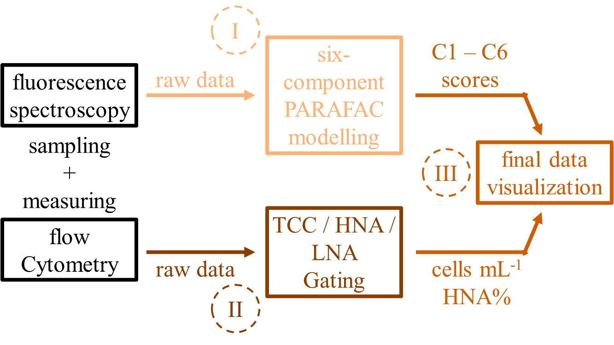

# Automatic data analysis of fluorescence spectroscopy (PARAFAC) and flow cytometry drinking water quality monitoring
## Overview
This is an approach to deal with continuous and automatic drinking water analysis via fluorescence spectroscopy with integrated PARAFAC analysis and flow cytometry. It enables a rapid and reliable status of the organic and microbial composition of the drinking water. Sudden changes in the drinking water quality can be identified and reacted accordingly. 

## Features
- Read DAT files (fluorescence spectroscopy) and FCS files (flow cytometry) automatically
- Perform PARAFAC analysis with a six-component model, and count cells automatically
- Visualize the data automatically
## Requirements 
### Hardware
- Fluorescence spectrometer Aqualog (HORIBA) plus  external sipper for sampling
- Flow cytometer CyFlow Cube 6 (Sysmex) with integrated measuring software CyView plus external OC-300 add-on (onCyt) for sampling and staining
### Software
- Fluorescence spectroscopy PARAFAC analysis is performed via open source [drEEM toolbox](https://dreem.openfluor.org/) [^1]
- MATLAB dependencies are listed in [dependencies_MATLAB.txt](/dependencies_MATLAB.txt)
- Flow cytometry data analysis is performed via open source [FlowKit toolbox](https://github.com/whitews/FlowKit?tab=readme-ov-file#documentation) [^2]
- Anaconda dependencies are listed in [dependencies_anaconda.txt](/dependencies_anaconda.txt)
[^1]: Murphy, K. R., Stedmon, C. A., Graeber, D., and Bro, R. (2013). Fluorescence spectroscopy and multi-way techniques. PARAFAC. Anal. Methods 5, 6557–6566. https://doi:10.1039/c3ay41160e.
[^2]: White, S., Quinn, J., Enzor, J., Staats, J., Mosier, S. M., Almarode, J., Denny, T. N., Weinhold, K. J., Ferrari, G., & Chan, C. (2021). FlowKit: A Python toolkit for integrated manual and automated cytometry analysis workflows. Frontiers in Immunology, 12. https://doi.org/10.3389/fimmu.2021.768541
## Documentation
### Preparation
1. Download both folders [flow_cytometry](/flow_cytometry/) and [fluorescence_spectroscopy](/fluorescence_spectroscopy/) including their containing subfolder and files.
2. Test data can be downloaded from [examples_raw_data_flow_cytometry](/examples_raw_data_flow_cytometry/) and [examples_raw_data_fluorescence_spectroscopy](/examples_raw_data_fluorescence_spectroscopy/).
### I - Fluorescence spectroscopy
1. Open [I_II_start_control.m](/I_I_start_control.m) in MATLAB
   - Adjust folder path in line 4
2. Open [I_II_PARAFAC.m](/I_II_PARAFAC.m) in MATLAB
   - Adjust folder path in line 2, 7, 10, 34, 83, 108, and 127
   - If needed, adjust the number of base data samples in line 15. No changes needed when using the data set provided here.
3. Prepare .xlsx and .txt files
   - [fingerprints_model6.xlsx](/fluorescence_spectroscopy/fingerprints_model6.xlsx): no changes needed when using the data set provided here.
   - [model_data_6.xlsx](/fluorescence_spectroscopy/model_data_6.xlsx): delete the old [model_data_6.xlsx](/fluorescence_spectroscopy/model_data_6.xlsx) from your drive, make a copy of [fingerprints_model6.xlsx](/fluorescence_spectroscopy/fingerprints_model6.xlsx) and rename the copy to 'model_data_6.xlsx'. This is the file for your new project.
   - [sak254.txt](/fluorescence_spectroscopy/sak254.txt): change value to 1.
   - [sak436.txt](/fluorescence_spectroscopy/sak436.txt): change value to 1.
   - [scores.xlsx](/fluorescence_spectroscopy/scores.xlsx): must only contain the data of 72 samples plus header. Otherwise, delete the rows below (i>72)
   - [scores_sak254.xlsx](/fluorescence_spectroscopy/scores_sak254.xlsx): must only contain values in the first row plus header. Values for the first row: SAK 254 -> 100, Date/Time -> 1, Absorbance in 1/m -> nan, Sample ID -> nan. Otherwise, delete the rows below.
   - [scores_sak436.xlsx](/fluorescence_spectroscopy/scores_sak436.xlsx): must only contain 100 in the first row + header. Otherwise delete the rows below.
4. Click 'Run' to start [I_II_start_control.m](/I_I_start_control.m) in MATLAB
### II - Flow Cytometry
1. Open [II_fcm.py](/II_fcm.py) in an Python environment.
   - Click 'Run' and follow through the request process.
   - Go until 'WAIT'. Continue by pressing 'Enter' when the first flow cytometry measurement is completed.
2. Prepare .xlsx files
   - [fcm_results.xlsx](/flow_cytometry/fcm_results.xlsx): delete all rows except header.
   - [fcm_scores.xlsx](/flow_cytometry/fcm_scores.xlsx): delete all rows except first and header. Set default value of the Index column, first row, at -1.
### III - Dashboard 
1. Open [III_app_online_dashboard.py](/III_app_online_dashboard.py) in an Python environment.
2. Click 'Run' and follow through the request process.
## Contribution and funding
jkhkjhhk
